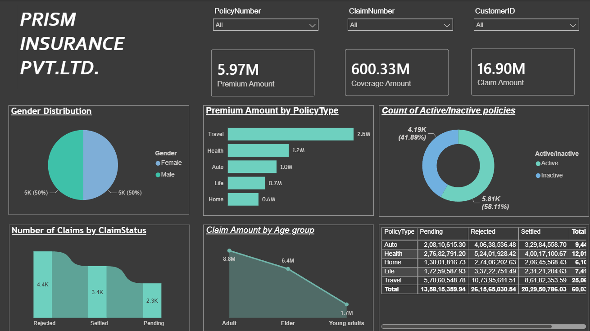
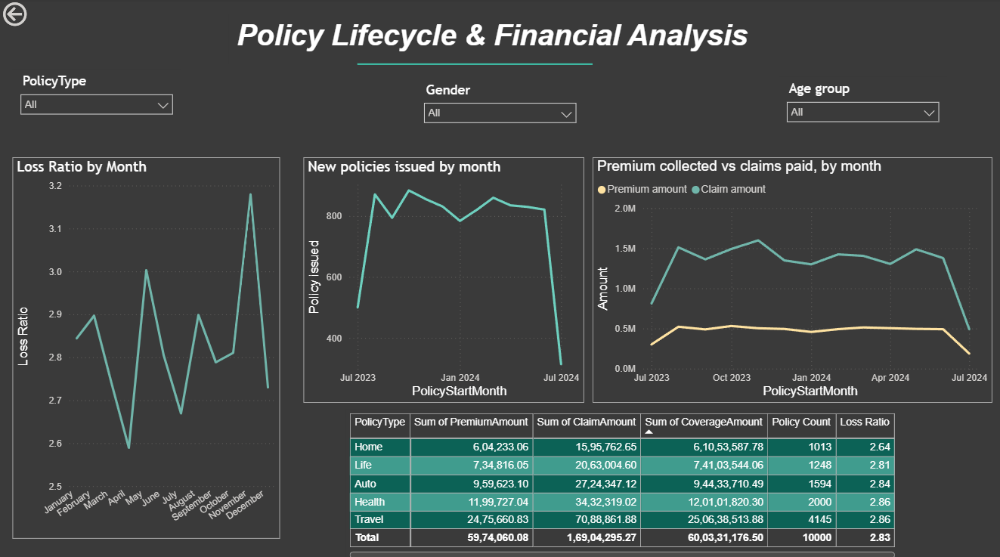
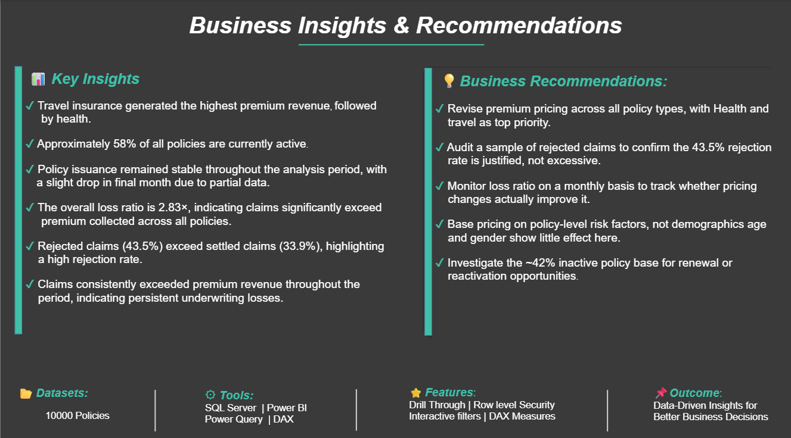

# Insurance-Analytics-Dashboard
Interactive Power BI dashboard for insurance policy, claim, and financial analysis using SQL Server, Power Query, and DAX.

📌 Project Overview
This project is an interactive Power BI dashboard developed to analyze insurance policy performance, premium revenue, claim trends, customer demographics, and financial metrics.
The dashboard provides business insights through interactive visualizations, DAX measures, Power Query transformations, and drill-through functionality.

🛠️ Tech Stack
- Power BI
- SQL Server
- Power Query
- DAX

✨ Features
- Interactive Dashboard
- Dynamic Slicers
- Drill Through Navigation
- Row-Level Security (RLS)
- Power Query Data Cleaning
- DAX Measures
- Business KPI Analysis
- Financial Performance Analysis

📊 Dashboard 
1. Executive Dashboard
- Premium Revenue Analysis
- Policy Status Distribution
- Gender Analysis
- Claim Status Analysis
- Age Group Analysis

2. Policy Lifecycle & Financial Analysis
- Monthly Policy Trends
- Premium vs Claims
- Loss Ratio
- Policy Financial Summary

3. Business Insights & Recommendations
- Key Insights
- Business Recommendations
- Dashboard Features
- Project Summary

📈 Key Features
- Interactive Slicers
- Drill Through
- Row-Level Security (RLS)
- Dynamic DAX Measures
- Power Query Data Cleaning
- Financial KPI Analysis

💡 Skills Demonstrated
- Data Cleaning
- Data Modeling
- DAX
- Power Query
- Dashboard Design
- Business Intelligence
- Data Visualization
- KPI Reporting

📄 Project Report

The complete dashboard is available in: Dashboard.pdf

# Dashboard Preview

# Executive Dashboard

Policy Lifecycle & Financial Analysis

# Business Insights & Recommendations

👨‍💻 Author
Manav Vijay
